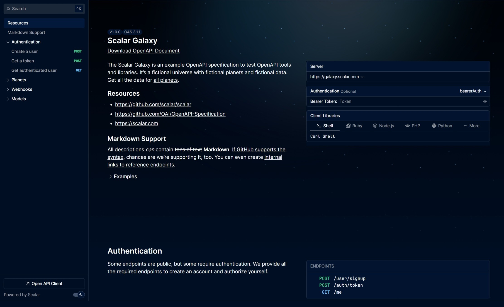

# Scalar for Go

<!-- [](https://www.npmjs.com/package/@scalar/hono-api-reference)
[](https://www.npmjs.com/package/@scalar/hono-api-reference)
[](https://www.npmjs.com/package/@scalar/hono-api-reference) -->

This package provides an easy way to render a beautiful API reference based on an OpenAPI/Swagger file with [Scalar](https://github.com/scalar/scalar).



## Installation

```bash
go get github.com/pakornv/scalar-go
```

## Usage

See [Scalar official documentation](https://github.com/scalar/scalar/blob/main/documentation/configuration.md) for more configuration details.

```go
package main

import (
  "net/http"

  "github.com/pakornv/scalar-go"
)

func main() {
  apiRef, err := scalar.New("https://cdn.jsdelivr.net/npm/@scalar/galaxy/dist/latest.yaml")
  if err != nil {
    panic(err)
  }

  router := http.NewServeMux()
  router.HandleFunc("GET /reference", func(w http.ResponseWriter, r *http.Request) {
    htmlContent, err := apiRef.RenderHTML()
    if err != nil {
      http.Error(w, err.Error(), http.StatusInternalServerError)
      return
    }

    w.Write([]byte(htmlContent))
  })

  http.ListenAndServe(":3000", router)
}
```

## Credits

- [Scalar](https://github.com/scalar/scalar)
- [Go Scalar API Reference](https://github.com/MarceloPetrucio/go-scalar-api-reference)

## License

The source code in this repository is licensed under [MIT](https://github.com/pakornv/scalar-go/blob/main/LICENSE).
